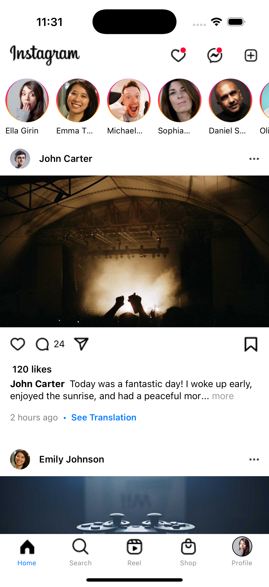
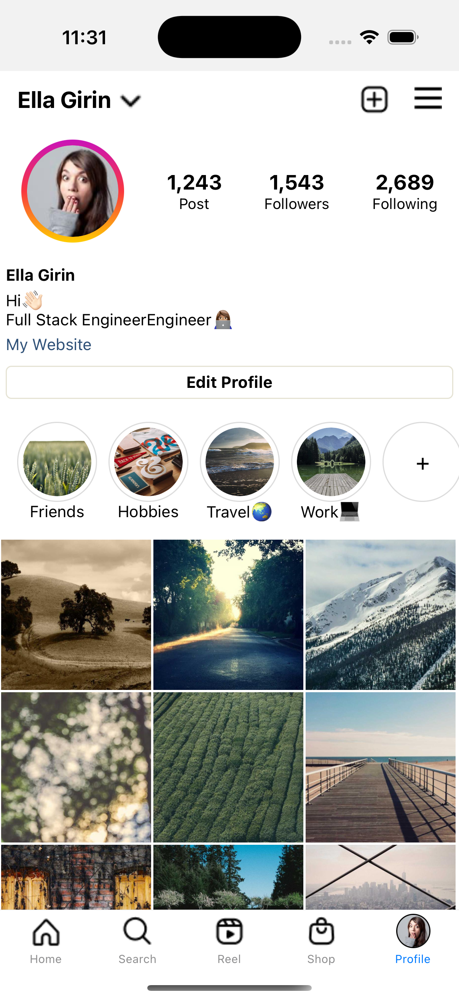

# 📸 Instagram 

This is a **React Native** Instagram-inspired project that features a homepage displaying posts with images, captions, likes, and comments. Users can navigate through different sections, including Home, Search, Reels, Shop, and Profile. 

## 📸 Screenshots

### **Homepage**

### **Profile Page**

## 💻 Technologies Used
React Native - For building the mobile UI.
React Navigation - To handle smooth navigation between pages.
JavaScript - Used for logic and interactivity.

## 📚 Libraries Used
This project uses several third-party libraries to enhance functionality:

- 📌 **React Navigation (Bottom Tabs):** For seamless tab-based navigation.
- 📜 **npm Read More:** To handle expandable text in post descriptions.